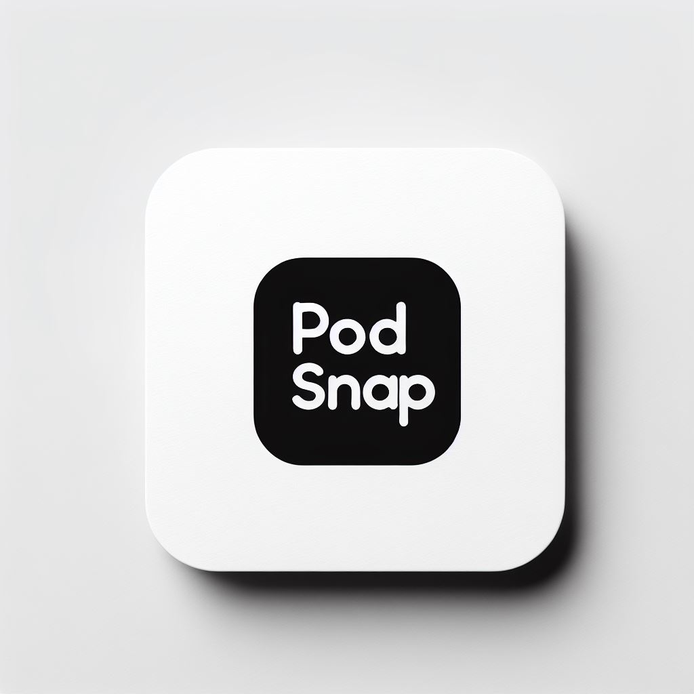

<div align="center">

<table>
  <tr>
    <td>
      <pre>
  ____           _ ____                    _ 
 |  _ \ ___   __| / ___| _ __   __ _ _ __ | |
 | |_) / _ \ / _` \___ \| '_ \ / _` | '_ \| |
 |  __/ (_) | (_| |___) | | | | (_| | |_) |_|
 |_|   \___/ \__,_|____/|_| |_|\__,_| .__/(_)
                                    |_|      
                                  v2024.11.02 
"PodSnap: Quick Podcast Summaries" 
      </pre>
    </td>
    <td>
      
    </td>
  </tr>
</table>

</div>

## Overview

**PodSnap** is a C#-based application designed to create concise summaries of podcast episodes. It integrates with Ollama to generate byte-sized summaries, making it easy to grasp the key points of any podcast quickly.

### Features

- **Podcast Integration**: Hooks into Apple Podcasts to fetch transcripts from episodes.
- **Customizable Summaries**: Allows users to adjust the size and scope of summaries based on their preferences.
- **Automated Chunking**: Uses a chunking algorithm to segment transcripts into manageable parts for summarization.

### Configuration

PodSnap uses configuration files to manage settings, making it easy to customize and update the application.

## Prerequisites

Before running the application, make sure you have the following:

- .NET 6.0 installed.
- Follow the setup guide.

## Usage

Click here for detailed usage instructions.

1. **Clone the repository**:
    ```sh
    git clone https://github.com/YourUsername/PodSnap.git
    cd PodSnap
    ```

2. **Set up the environment**:
    ```sh
    dotnet restore
    dotnet build
    ```

3. **Run the application**:
    ```sh
    dotnet run
    ```

## Configuration File Location

- **Application Settings**: `$INSTALL_ROOT/PodSnap/etc/appsettings.json`
- **User Preferences**: `$INSTALL_ROOT/PodSnap/etc/user_preferences.json`

## Supported Platforms

This application supports Windows, macOS, and Linux systems.

## Limitations

- Requires manual setup of API keys for Apple Podcasts and Ollama.
- Limited by the computational limits of the user's LLM engine’s context size.

## Contribution Requirements

### Formatter

This project uses Prettier for code formatting.

## License

This project is licensed under the **MIT License**.
